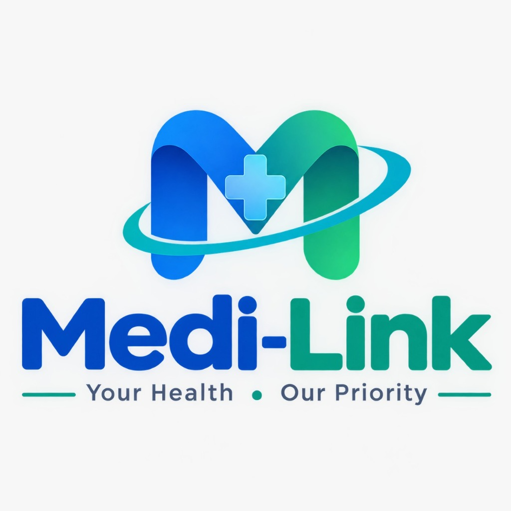

# 🏥 MEDI-LINK

> **“Right Care. Right Doctor. Right Place. Right Time.”**  
> *Subtitle: “Your Health • Our Priority”*

[](https://python.org)
[](https://fastapi.tiangolo.com)
[]()
[]()
[]()

---

## 🌟 Overview

**MEDI-LINK** is an AI-integrated, full-stack healthcare ecosystem designed to address the fragmentation in modern medical care. Rather than focusing exclusively on large corporate hospitals, MEDI-LINK unites **multi-tier healthcare providers**—including super-speciality hospitals, community clinics, Registered Medical Practitioners (RMPs), and licensed Ayurvedic vaidyas—into one transparent, patient-centric digital platform.

---

## 📸 Platform Identity & Official Logo



*Medi-Link: Your Health • Our Priority*

---

## 👥 Supported User Roles

1. **Patients**: Discover care options, triage symptoms with AI, book appointments across care tiers, monitor live queue tokens, locate medications, pledge blood/organs, and access emergency services.
2. **Specialist Doctors**: Manage outpatient consultations, teleconsultations, and electronic patient records.
3. **RMP Doctors (Registered Medical Practitioners)**: Neighborhood family practitioners with verified community track records and direct home visit offerings for elderly and bedridden patients.
4. **Ayurvedic Practitioners (BAMS / MD AYUSH)**: Holistic care, pulse diagnosis (*Nadi Pariksha*), herbal formulations, and chronic joint/digestive care.
5. **Community Clinics**: Walk-in primary care, viral fever triage, pediatric vaccinations, and routine diagnostics.
6. **Multi-Speciality Hospitals**: Tertiary care facilities with 24x7 Emergency/Trauma, ICU, Cath Labs, and comprehensive outpatient department (OPD) queue dispatching.
7. **Hospital Staff & Administrators**: Receptionists and triage coordinators managing OPD counters, calling tokens, broadcasting delay updates, and managing patient queue flow.
8. **Pharmacies & Medical Shops**: 24x7 retail chemists, hospital dispensaries, and Ayurvedic herbal stores with stock inventory and prescription verification.

---

## 🏗️ Architecture & Technology Stack

```
MEDI-LINK Full-Stack Architecture
├── Backend: Python 3.13 + FastAPI (Asynchronous REST API)
│   ├── Database: SQLite (ACID compliant, relational schema, zero external dependencies)
│   ├── Security: PBKDF2-HMAC-SHA256 password hashing + signed JWT Bearer Tokens
│   ├── Service Layer: Modular business logic for Auth, Doctors, Hospitals, Appointments,
│   │                 Queue, Pharmacy, Blood, Organ, AI Jarvis, Emergency, Vitals
│   └── API Routers: 11 specialized RESTful domain routers mounted on /api/*
│
├── Frontend: Modern Modular Component Architecture (Zero Node build required)
│   ├── Shell: static/index.html (Semantic HTML5, Accessible Landmarks, ARIA Live)
│   ├── Styling: Tailwind CSS + static/css/app.css (Healthcare Palette, ECG Animations)
│   ├── State Store: static/js/config.js (Reactive Event-driven client state)
│   ├── Centralized API Client: static/js/api.js (Automatic JWT handling & toast errors)
│   ├── Client Router: static/js/router.js (Hash-based history routing across 19 views)
│   └── Views: Modular ES6 view controllers for every route
│
└── AI Assistant: MEDI-LINK Jarvis (Safety-first clinical triage & prescription breakdown)
```

---

## 🚀 Key Modules & Capabilities

### 1. 🔐 Authentication & Role-Based Access
- **Routes**: `/login`, `/register`, `/staff/login`, `/staff/register`
- **Fields**: Patient registration (Name, Email/Gmail, Mobile, Location, Password, Confirm Password) and Staff registration (Employee Name, Email, Mobile, Location, Hospital Affiliation, Department, Password).
- **Security**: PBKDF2-HMAC-SHA256 with cryptographically random salts, signed JWT access tokens, input validation via Pydantic.

### 2. 📊 Patient Dashboard (`/dashboard`)
- Consolidated upcoming appointment widget with live OPD queue token, serving token, and estimated wait times.
- Real-time biometric vitals snapshot (Heart Rate, SpO2, Blood Pressure, Steps).
- 12 quick-access healthcare service cards.
- Recent appointment history and audit logs.

### 3. 🩺 Multi-Tier Doctor & Hospital Discovery (`/doctors`, `/hospitals`)
- Filter by location, specialty, department, facility type (Hospital, Clinic, RMP, Ayurveda), and home visit availability.
- Verified factual provider credentials (MCI / State Medical Council / AYUSH registration numbers, experience years, consultation fees, timings).
- **No arbitrary "best" rankings**—transparent, objective comparison.

### 4. 🎯 Hospital & Care Suitability Matcher (`/suitability`)
- Patient enters health concern (e.g. *"Severe knee osteoarthritis pain"*, *"Chest tightness and breathlessness"*).
- Clinical triage algorithm identifies matching department, care tier, matching facilities, and provides a clear clinical explanation of why this department is suitable.

### 5. 📅 7-Step Interactive Booking Wizard (`/book`)
- **Step 1**: Choose Facility / Provider Tier
- **Step 2**: Select Department
- **Step 3**: Select Doctor / Practitioner
- **Step 4**: Select Appointment Date
- **Step 5**: Pick Available Time Slot
- **Step 6**: Eligibility Check (Elderly escort, wheelchair assistance, symptoms notes)
- **Step 7**: Review & Confirm with generated Appointment ID (`ML-2026-XXXX`) and Queue Token (`OP-XX`).

### 6. 📋 Appointment Management (`/appointments`)
- Statuses: `PENDING`, `CONFIRMED`, `WAITING`, `IN_PROGRESS`, `COMPLETED`, `CANCELLED`, `RESCHEDULED`.
- Interactive cancellation modal with reason collection and confirmation dialog.
- Interactive rescheduling modal with new date/slot selection.
- Full clinical audit trail tracking every status transition and actor.

### 7. ⏳ Live OPD Queue & Waiting Time Tracker (`/queue`)
- Real-time animated token tracking (Your Token, Serving Token, Patients Ahead, Estimated Wait Time).
- Emergency delay alert notifications.
- **Interactive Queue Simulator**: Staff or demo users can advance tokens and broadcast delays in real time.

### 8. 🧭 Hospital Indoor Wayfinding (`/navigation`)
- Designed for elderly and first-time hospital visitors.
- Building/Block, Floor Level, Counter/Room number, and step-by-step route directions.
- Direct wheelchair-accessible route guidance.

### 9. 💊 Medicine & Pharmacy Finder (`/pharmacy`)
- Search by brand name (e.g. *Dolo 650*, *Augmentin 625*, *Pan 40*, *Telma 40*, *Ashwagandha*) or generic drug.
- Real-time pharmacy inventory status, price, distance (km), and contact dialer.
- Prescription requirement badges (`Rx Required` vs `OTC Friendly`).
- In-store counter pickup reservation.

### 10. 🩸 Blood Services (`/blood`)
- Voluntary blood donor registration with ABO/Rh group eligibility.
- Emergency blood request broadcaster with urgency levels (`CRITICAL`, `URGENT`, `SCHEDULED`).
- Regional certified blood bank stock units summary (Demo feed).

### 11. 🫀 Organ Donation & Transplant Registry (`/organ`)
- Informed voluntary organ donor pledge registration (Kidneys, Liver, Heart, Cornea, Lungs, Pancreas).
- Hospital transplant waiting list application aligned with THOTA and NOTTO guidelines.
- Strict legal and anti-commercialization notices.

### 12. 🏠 Home Doctor Visits (`/home-visit`)
- Dedicated bedside visit booking for bedridden, post-operative, or elderly patients.
- Verified RMP family doctors, general physicians, and Ayurvedic Vaidyas with arrival tracking.

### 13. 🤖 MEDI-LINK AI: Jarvis-Style Assistant (`/ai`)
- **Speech & Text**: Web Speech Recognition API microphone input + Text-to-Speech audio readout.
- **Clinical Triage**: Guides users to the correct medical department.
- **Prescription Explanation**: Explains drug purposes, administration timings (before/after food), precautions, and questions for physicians.
- **Nutritional Counseling**: Balanced dietary guidelines for cardiovascular, diabetic, and Ayurvedic gut health.
- **Safety Intercept**: Immediate detection of red-flag symptoms (chest pain, stroke signs, breathing difficulty) that triggers urgent emergency warnings and dial 108 prompts.

### 14. ⌚ Health & Wearable Monitoring (`/vitals`)
- Simulated Bluetooth BLE wearable telemetry (Heart Rate, SpO2, Blood Pressure, Body Temperature, Steps).
- Validated clinical thresholds (Normal, Warning, Critical).
- Interactive simulator buttons to test normal, elevated, and critical cardiac anomalies.

### 15. 🚨 Emergency 24x7 Hub (`/emergency`)
- High-visibility red emergency action with heartbeat animation.
- **Emergency Alert (SOS)**: Instant dispatch simulation with vehicle number and live ETA.
- **Priority ER Booking**: Pre-arrival notification to trauma medical officers.
- **Offline First-Aid Medical Card**: Locally cached ICE contacts, blood group, and life-saving guides (CPR, Heimlich choking, severe bleeding, snakebite).

### 16. 👓 Accessibility & Easy Mode
- One-click navbar toggle for elderly and low-vision patients.
- 125% typography scaling, WCAG AAA high contrast, minimum 52px touch targets, and spoken audio cues.

### 17. 🏥 Hospital Staff Console (`/staff/dashboard`)
- Live queue dispatcher to call next tokens and broadcast delays.
- Incoming patient check-in table with status updates (`WAITING` &rarr; `IN_PROGRESS` &rarr; `COMPLETED`).

---

## 🛠️ Quickstart & Setup Guide

### Prerequisites
- Python 3.10+ (tested on Python 3.13)
- Git

### Installation

1. **Clone the Repository**:
   ```bash
   git clone https://github.com/<your-username>/medi-link.git
   cd medi-link
   ```

2. **Install Dependencies**:
   ```bash
   pip install -r requirements.txt
   ```

3. **Start the Application**:
   ```bash
   python main.py
   ```
   *Or with Uvicorn directly:*
   ```bash
   uvicorn main:app --host 0.0.0.0 --port 8000 --reload
   ```

4. **Access the Platform**:
   - **Web Application**: [http://localhost:8000/](http://localhost:8000/)
   - **Interactive Swagger API Docs**: [http://localhost:8000/docs](http://localhost:8000/docs)
   - **ReDoc API Documentation**: [http://localhost:8000/redoc](http://localhost:8000/redoc)

---

## 🧪 Automated Testing

MEDI-LINK includes an end-to-end automated test suite covering all 12 core domains.

Run tests:
```bash
python -m unittest tests/test_api.py -v
```

**Results**:
```
Ran 12 tests in 0.292s
OK
```

---

## 🔑 Demo Login Accounts

| Role | Email | Password | Details |
|------|-------|----------|---------|
| **Patient** | `patient@medilink.com` | `patient123` | Rajesh Kumar (Banjara Hills, Hyderabad) |
| **Hospital Staff** | `staff@cityhospital.com` | `staff123` | Priya Sharma (City General Hospital, OPD) |
| **Doctor** | `doctor.sharma@apollo.com` | `doctor123` | Dr. Arvind Sharma, MD DM (Cardiology) |

*You can also register any new patient or hospital staff account directly via `/register` or `/staff/register`.*

---

## 🌐 GitHub Repository Setup & Push Instructions

To push this repository to GitHub:

1. Create a new empty repository on [GitHub](https://github.com/new) named `medi-link`.
2. In your terminal, run:
   ```bash
   # Add remote
   git remote add origin https://github.com/<your-github-username>/medi-link.git

   # Push to main branch
   git push -u origin main
   ```

---

## ⚖️ Legal & Medical Disclaimer

MEDI-LINK is an intelligent healthcare navigation, clinical triage, and hospital coordination software platform. It is designed to assist patients in finding verified healthcare services and understanding medical processes. It does not provide certified medical diagnoses or replace emergency medical response services. In life-threatening emergencies, patients must immediately contact emergency services (108 or 112) or proceed to the nearest emergency trauma center.

---

**MEDI-LINK &mdash; Right Care. Right Doctor. Right Place. Right Time.**
